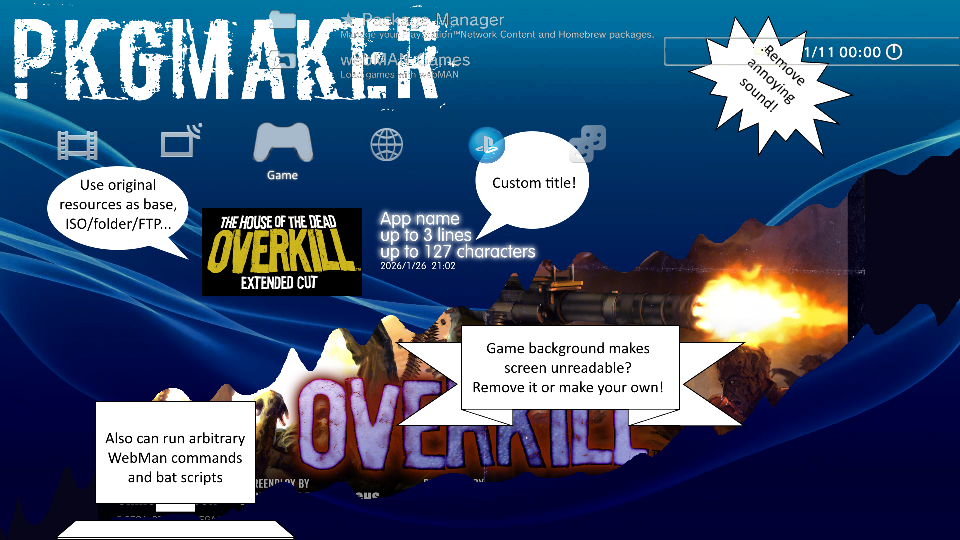

# ToolStation

Tools for PS3

## PkgMaker <span float="left"></span>



Ever wanted to... 

* customize how game icon or background look without modifying ISO or backup folder?
* remove annoying sound or animation when game is selected in XMB?
* have ISO/folder games listed along with other installed stuff to assign custom categories/folders?

Now you can do it, semi-automated way. Single binary, no dependencies.

`PkgMaker` creates `.pkg`s that launch games from iso or folder-style backups. Everything about look and behavior of the launcher is customizable: title, XMB icons/pictures, etc. Existing games can be used as templates so you don't need to download ISOs and extract icons. Launcher can also execute arbitrary Webman commands or scripts from XMB for all your automation needs.

My own motivation was to have several Just Dance games that can be launched from XMB directly by guests during parties, so that i don't need to explain how to mount images, and have a way to see song list before loading actual game.

```sh
PkgMaker launcher --base "ftp://10.10.10.3/PS3ISO/JD4 BLUS31033.iso" --background "songlist_for_jd4.png" --sound none --overlay none --overlay-sd none --video none --preview
```

And here's what i have. Custom background image, icon and name taken from ISO, annoying sound removed:


### Usage

`PkgMaker` is a console app. Everything is described in `--help`. There are 2 commands: `launcher` to build pkg, and `prepare` to look for games and output a script for later editing and building packages. If you want to create launchers for all existing games on your PS3 in bulk, do it with `prepare` and specify remote location like `ftp://ps3.lan/dev_hdd0` or `http://10.10.10.3/`. Then edit generated `make_launch_pkgs` script to provide custom backgrounds for each game, disable sounds, change games to launch etc.

For best results i recommend storing ISOs and game folders with a TITLE_ID in their names - this way Webman will have no problem locating unique games.

If you want to mass install generated packages, place them on the root of USB drive, this way you'll have "install all" option in package manager.

If you rebuild a launcher and install it, files will be overwritten, but existing files won't be deleted. So you'll see updated icons, but if you decided to disable background - it won't go away. You have to uninstall launcher first.

### Examples for `launcher`

#### Simple shortcut

`PkgMaker launcher -t "My launcher" -g "overkill" -icon "my icon.png" -p`

Specify app title, game to launch, set icon, generate preview. Webman will search for iso or folder with "overkill" in its name, and launch if found only 1 game

#### Using base game

`PkgMaker launcher -b "JD4 BLUS31033.iso"`

With ISO as base, copy its pictures. Set launcher title "Just Dance 4", and game to launch "BLUS31033" - both read from PARAM.SFO 

#### Using base game with overrides

`PkgMaker launcher -b "backups/JustDanceMod2020v2" --background "" -g "JustDanceMod"`

With folder as base, copy pictures but remove background. Set launcher title "Just dance 2020" from PARAM.SFO. Customize game name to launch - beacuse game file/folder is named differently and default search by title_id will fail

#### Using custom base

`PkgMaker launcher -b "folder/with/stuff" -t "my title" -g "my game"`

With folder as base, copy pictures. There is no PARAM.SFO, so set launcher title and game name to launch

#### Web command

`PkgMaker launcher -t $'beep beep!\nwait\nbeep beep!' -l BEEPEREXAMPLE000 -c "/beep.ps3?2;/wait.ps3?1;/beep.ps3?2" -s ""`

Specify multiline app title (bash syntax), label, custom Webman command, and exclude script file because we won't need it anyway

### Debugging

* Check if Webman is OK, launcher relies on its web commands
* Launcher files are in /dev_hdd0/game/Wxxxxxxxx/USRDIR
* launch.txt has HTTP command for Webman, try it in browser manually
* script.txt is a Webman bat that is called from HTTP command. Try executing it yourself, inserting beep1/beep2 between lines to see where it fails
* No access to files? Check launcher "Update History" in XMB, launch and script contents are copied there by default

### Examples for `prepare`

#### Remote PS3ISO

`PkgMaker prepare -s 'ftp://192.168.0.3/dev_hdd0/PS3ISO'`

For every ISO, script will have a line to build launcher pkg using remote ISO as base

#### Remote folders

`PkgMaker prepare -s 'http://192.168.0.3/dev_hdd0/GAMES'`

Same for every game folder

#### Local games

`PkgMaker prepare -s 'path/to/backups/' -r`

Scan for ISOs or game folders recursively

#### Remote everything

`PkgMaker prepare -s 'ftp://192.168.0.3' -r`

Scan for ISOs or game folders everywhere on remote system

### Notes

* Idea is to scan for existing games, use them as base (titles, icons, etc), then manually review and customize script before making packages
* For PS1/PS2/PSP ISOs you have edit script and add title (-t) manually, or making launcher will fail
* Other formats mountable by Webman (ROMS, .BIN/.CUE, etc) are not supported yet. Create Github issue if you can help with testing
* Some folders are blacklisted from search over FTP and HTTP to avoid wasting time, eg `/dev_blind` or `/dev_hdd0/game`

## EBOOT.BIN

Compiled homebrew, based on `PKGLAUNCH`. How it works:

* `syscall 30` to determine current TITLE_ID
* assume current app working directory is `/dev_hdd0/game/TITLE_ID/`
* parse `./USRDIR/launch.txt` into URL command for Webman and make HTTP request
* by default, launch.txt triggers `./USRDIR/script.txt`
* default script is to mount and launch a game

Since app knows its own TITLE_ID, it is not required to compile, patch or resign it every time for different launchers.

## Credits

* PkgMaker inspired by [Webman-Classics-Maker](https://github.com/Roet-Ivar/Webman-Classics-Maker). Great idea and tool! It just didn't quite work for me so i decided to roll my own
* Launcher binary is based on `PKGLAUNCH`, and everything relies on [webMAN-MOD](https://github.com/aldostools/webMAN-MOD) to work
* PKG and SFO code based on [SCEllSharp](https://github.com/InvoxiPlayGames/SCEllSharp) and [pkg_custom.py](https://github.com/aldostools/webMAN-MOD/tree/master/_Projects_/pkglaunch/pypkg)
* [PSL1GHT](https://github.com/ps3dev/PSL1GHT), [ps3toolchain](https://github.com/ps3dev/ps3toolchain)

## TODO

No implemented yet - feel free to open issues so that i know anyone needs these:

* making pkgs that install files in arbitrary locations
* making pkgs of other content types without providing external param.sfo
* support other webman mountable game formats: ROMS, PSX BIN/CUE, etc
* PSP ISO: extracting param.sfo and icons, proper autostart
* UI if anyone needs it?